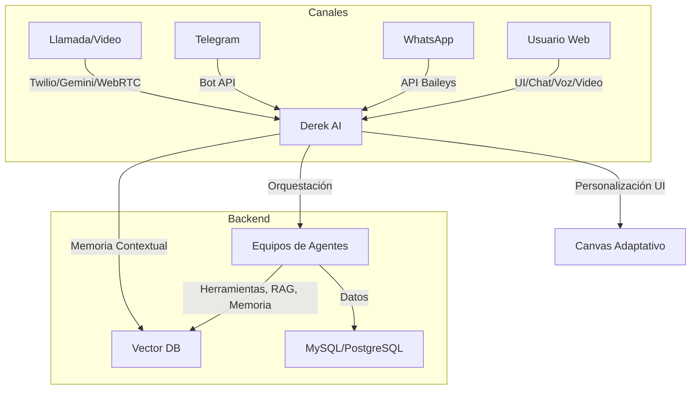
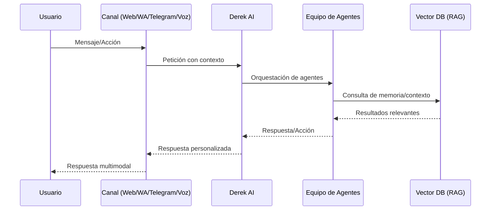

# Propuesta Técnica del Proyecto NexusMetriks (2025)

## Índice
1. [Resumen General](#resumen-general)
2. [Arquitectura General y Stack Tecnológico](#arquitectura-general-y-stack-tecnológico)
3. [Estructura de Directorios y Refactorización](#estructura-de-directorios-y-refactorización)
4. [Descripción de Módulos y Equipos de Agentes](#descripción-de-módulos-y-equipos-de-agentes)
5. [Flujos Principales y Orquestación Multiagente](#flujos-principales-y-orquestación-multiagente)
6. [Internacionalización y Personalización Agentificada](#internacionalización-y-personalización-agentificada)
7. [Frontend, UI/UX y Canvas Adaptativo](#frontend-uiux-y-canvas-adaptativo)
8. [RAG, Vector DB y Memoria Empresarial](#rag-vector-db-y-memoria-empresarial)
9. [Diagramas de Arquitectura y Flujos](#diagramas-de-arquitectura-y-flujos)
10. [Seguridad, Multi-Tenancy y Buenas Prácticas](#seguridad-multi-tenancy-y-buenas-prácticas)
11. [Conclusiones y Recomendaciones](#conclusiones-y-recomendaciones)
12. [Colaboración, Gestión de Equipos y Trabajo Colaborativo](#colaboración-gestión-de-equipos-y-trabajo-colaborativo)

---

## 1. Resumen General

**NexusMetriks** es una plataforma SaaS AI-native para la gestión, análisis, optimización y automatización de marketing digital, basada en un sistema orquestador de equipos de agentes autónomos. El orquestador central es **Derek AI**, un agente cognitivo capaz de interactuar y controlar todos los módulos, herramientas y la experiencia de usuario, accesible desde múltiples canales (web, WhatsApp, Telegram, voz, video, etc.).

La plataforma funciona como un "ente vivo": cada módulo es un equipo de agentes, la UI es completamente manipulable por agentes, y la personalización es total a nivel de usuario, equipo y empresa. El sistema soporta interacción multimodal (texto, voz, video), memoria contextual (RAG), y multitenencia real.

---

## 2. Arquitectura General y Stack Tecnológico

### **Backend**
- **Python 3.13+**
- **Flask 3.x** (API principal, microservicios)
- **LangGraph** (orquestación multiagente, flujos de agentes)
- **LangChain** (herramientas, chains, integración LLMs, RAG)
- **LlamaIndex** (opcional, para pipelines RAG avanzados)
- **FastAPI** (microservicios de agentes, WebSockets)
- **Flask-SocketIO / Quart** (comunicación en tiempo real, voz)
- **MySQL / PostgreSQL + pgvector** (datos y vector DB)
- **ChromaDB / Pinecone / Qdrant** (vector DB para RAG, memoria empresarial)
- **Authlib, OAuth2, JWT** (autenticación y seguridad)

### **Frontend**
- **HTML5, CSS3, Bootstrap 6** (UI principal, responsive, dark mode)
- **JavaScript ES2025+** (interactividad, canvas adaptable)
- **Web Components / React** (componentes UI agentificados)
- **Canvas JS/HTML5** (UI adaptable y personalizable por agentes)
- **WebSockets** (comunicación en tiempo real, voz, eventos de UI)

### **IA, NLP y Voz**
- **OpenAI GPT-4o, Gemini 2.5, Llama 3** (LLMs, agentes)
- **OpenAI Whisper v4, Deepgram, Google STT/TTS, ElevenLabs** (voz a texto, texto a voz)
- **LangChain Tools, LangChain MCP** (integración de herramientas y servidores externos)

### **Integraciones y Canales**
- **WhatsApp API (Baileys Node.js, microservicio)**
- **Telegram Bot API**
- **Twilio Voice, Google Gemini Multimodal Live** (llamadas, voz a voz)
- **WebRTC** (llamadas y video en navegador)

### **Otros**
- **Docker, Kubernetes** (despliegue y escalabilidad)
- **OAuth2, RBAC, cifrado** (seguridad y control de acceso)
- **Observabilidad: Dashboards, logging, tracing**

---

## 3. Estructura de Directorios y Refactorización

La base actual se mantiene, pero cada módulo se refactoriza como un equipo de agentes autónomos, y la UI se reorganiza para ser completamente agentificada y personalizable.

```
├── src/
│   ├── app.py                # Núcleo Flask, inicialización de orquestador y agentes
│   ├── agents/               # Agentes orquestadores, equipos y herramientas
│   ├── models/               # Entidades, usuarios, empresas, equipos
│   ├── businessideas.py      # Equipo de agentes: generación de ideas
│   ├── calculador.py         # Equipo de agentes: métricas y ROI
│   ├── funnel.py             # Equipo de agentes: embudo de ventas
│   ├── keywords.py           # Equipo de agentes: keywords
│   ├── ga4.py, facebook_ads.py, metaads.py, googleads.py, hubspotcrm.py
│   ├── payments.py, pagospp.py # Equipo de agentes: pagos y créditos
│   ├── utils.py              # Utilidades, helpers, contextos
│   ├── static/               # CSS, JS, imágenes, fuentes, canvas
│   ├── templates/            # Plantillas HTML, componentes UI agentificados
│   ├── translations/         # Internacionalización
│   ├── config.py             # Configuración, planes, parámetros de agentes
│   └── ...
├── requirements.txt          # Dependencias Python (ver sección stack)
├── package.json              # Dependencias JS (Baileys, Web Components, etc.)
├── README.md                 # Documentación
```

**Nota:** Se recomienda separar microservicios de canales (ej: WhatsApp) en subdirectorios o repos dedicados.

---

## 4. Descripción de Módulos y Equipos de Agentes

### **Orquestador Central: Derek AI**
- Controla y coordina todos los equipos de agentes y la UI.
- Mantiene contexto global, memoria, preferencias y estado de usuario/empresa.
- Expone API multicanal (web, WhatsApp, Telegram, voz, video).
- Gestiona la personalización de la UI y la experiencia agentificada.

### **Equipos de Agentes (por dominio)**
Cada módulo actual se convierte en un equipo de agentes autónomos, con herramientas y memoria propia, orquestados por Derek AI:
- **Análisis Web, SEO, Tráfico, Embudos, Keywords, Estrategias, Ideas de Negocio, News, etc.**
- Cada equipo puede usar herramientas LangChain, chains, RAG, y acceder a la memoria empresarial.
- Los equipos pueden ser invocados por Derek AI según el contexto, canal o petición del usuario.

### **Canales y Multimodalidad**
- **Web:** UI agentificada, chat, voz, video, canvas adaptable.
- **WhatsApp:** Microservicio Node.js (Baileys), integración con Flask vía API/WebSocket.
- **Telegram:** Bot API, integración directa.
- **Voz/Video:** Twilio, Gemini Multimodal Live, WebRTC.

### **RAG y Memoria Empresarial**
- Cada usuario/empresa puede cargar documentación propia (PDF, DOCX, TXT, etc.).
- El sistema indexa y vectoriza los documentos (ChromaDB, Pinecone, Qdrant, pgvector).
- Los agentes acceden a la memoria contextual y la usan en las respuestas y acciones.

### **UI/UX Agentificada**
- Toda la interfaz es manipulable por agentes: colores, distribución, widgets, formularios, dashboards.
- El usuario puede personalizar la UI por chat/voz/órdenes.
- El agente tiene contexto en tiempo real de la pantalla y puede modificar la experiencia.

---

## 5. Flujos Principales y Orquestación Multiagente

### **Flujo de Orquestación**
1. Usuario interactúa por cualquier canal (web, WhatsApp, voz, etc.).
2. Derek AI recibe la petición, determina el contexto, canal, usuario y empresa.
3. Orquesta los equipos de agentes necesarios (ej: análisis web, pagos, RAG).
4. Los agentes consultan la memoria, herramientas y contexto.
5. Derek AI compone la respuesta, actualiza la UI y/o responde por el canal adecuado.
6. Toda la interacción queda registrada en la memoria contextual y vectorial.

### **Flujo de Personalización UI**
- El usuario puede pedir cambios de UI (colores, widgets, distribución) por chat/voz.
- Derek AI interpreta la orden y modifica la UI en tiempo real (canvas adaptable).
- La personalización se guarda por usuario, equipo y empresa.

### **Flujo RAG Empresarial**
- El usuario/empresa sube documentos.
- El sistema los vectoriza y los asocia a la memoria de la empresa.
- Los agentes pueden consultar y citar información de la memoria en cualquier canal.

---

## 6. Internacionalización y Personalización Agentificada

- **Flask-Babel** y archivos `.po/.mo` para EN, ES, FR, PT.
- El idioma y preferencias se gestionan por agentes y se almacenan en la memoria contextual.
- La UI y las respuestas de los agentes se adaptan automáticamente al idioma y preferencias del usuario.

---

## 7. Frontend, UI/UX y Canvas Adaptativo

- **Canvas adaptable:** Toda la UI es un canvas manipulable por agentes y por el usuario.
- **Componentes agentificados:** Widgets, dashboards, formularios, gráficos, todos controlados por agentes.
- **Chat agentificado:** Chat colapsable a la derecha, ocupa toda la pantalla al abrirse, con soporte de voz y video.
- **Barra lateral izquierda:** Herramientas y módulos, ahora controlados por agentes y personalizables.
- **WebSockets:** Para eventos en tiempo real, actualizaciones de UI y feedback inmediato.

---

## 8. RAG, Vector DB y Memoria Empresarial

- **Carga de documentos:** PDF, DOCX, TXT, etc. por usuario/empresa.
- **Vectorización:** sentence-transformers, OpenAI, Cohere, HuggingFace.
- **Almacenamiento:** ChromaDB, Pinecone, Qdrant, pgvector (PostgreSQL).
- **Consulta:** Búsqueda semántica, filtrado por metadatos, acceso multi-tenant.
- **Integración:** LangChain RAG Toolkit, LlamaIndex, acceso directo desde agentes.

---

## 9. Diagramas de Arquitectura y Flujos

### **Arquitectura General Multiagente**


### **Flujo Multiagente y RAG**


---

## 10. Seguridad, Multi-Tenancy y Buenas Prácticas

- **Multi-tenancy:** Separación de datos y contexto por usuario, equipo y empresa.
- **RBAC:** Control de acceso por roles y niveles (usuario, admin, empresa, agente).
- **Cifrado:** Datos sensibles cifrados en tránsito y en reposo.
- **OAuth2/JWT:** Autenticación y autorización segura.
- **Auditoría:** Logs de acciones de agentes, cambios de UI, accesos a memoria.
- **Observabilidad:** Dashboards de estado de agentes, flujos y contexto.
- **Despliegue:** Docker, Kubernetes, CI/CD para despliegue industrial y escalable.

---

## 11. Conclusiones y Recomendaciones

NexusMetriks evoluciona a una plataforma SaaS AI-native, multiagente, orquestada y completamente personalizable, lista para producción y escalabilidad industrial. Se recomienda:
- Refactorizar módulos actuales como equipos de agentes autónomos.
- Implementar la orquestación central con LangGraph y Derek AI.
- Adoptar RAG y vector DB multi-tenant para memoria empresarial.
- Agentificar la UI y habilitar personalización total vía agentes.
- Mantener el stack actualizado y auditar seguridad y escalabilidad.

---

## 12. Colaboración, Gestión de Equipos y Trabajo Colaborativo

### Visión General
NexusMetriks evoluciona para ser la plataforma colaborativa AI-native definitiva para agencias y empresas de marketing, permitiendo que equipos humanos (marketing, comercial, gerencial, etc.) trabajen de forma colaborativa y sin fricciones junto a los agentes autónomos, en un entorno similar a Slack, Notion y Monday, pero con la diferencia de que la ejecución y automatización la realiza el sistema multiagente dirigido por Derek AI.

### Capacidades Clave
- **Espacios de trabajo y canales colaborativos:** Cada empresa, equipo o proyecto cuenta con espacios de trabajo, canales temáticos, chats grupales y privados, y paneles de planificación.
- **Chats, hilos y menciones:** Conversaciones en tiempo real, hilos por tema, menciones a miembros y agentes, integración de voz y video.
- **Paneles de planificación y seguimiento:** Dashboards colaborativos para planificación de campañas, tareas, objetivos, KPIs y progreso, con visualización en tiempo real.
- **Historial de actividades y auditoría:** Registro completo de todas las acciones, decisiones, conversaciones y ejecuciones, tanto humanas como de agentes, con trazabilidad y búsqueda avanzada.
- **Notificaciones inteligentes:** Alertas y notificaciones automáticas por chat, email, WhatsApp, llamadas o integraciones externas, generadas por agentes según reglas, eventos o IA.
- **Gestión de tareas y flujos de trabajo:** Asignación de tareas, deadlines, dependencias, checklist, y automatización de flujos de trabajo, con agentes como ejecutores principales.
- **Colaboración multimodal:** Soporte para colaboración por texto, voz, video, archivos, pizarras digitales y comentarios en contexto.
- **Integración con herramientas externas:** Conexión con Google Workspace, Microsoft 365, CRMs, calendarios, y otras plataformas colaborativas.
- **Privacidad y permisos avanzados:** Control granular de acceso, visibilidad y edición por usuario, equipo, empresa y agente.

### Ejemplo de Flujo Colaborativo
1. Un equipo de marketing crea un canal para una nueva campaña.
2. Los miembros discuten ideas, asignan tareas y planifican acciones junto a Derek AI y los agentes especialistas.
3. Derek AI ejecuta automáticamente tareas (envío de emails, generación de reportes, actualización de dashboards, etc.) y notifica al equipo del progreso.
4. Todo queda registrado en el historial, y los paneles muestran el avance y los resultados en tiempo real.
5. El equipo puede reunirse por chat, voz o video, y los agentes pueden participar, tomar notas, sugerir acciones y ejecutar tareas.

### Stack y Consideraciones Técnicas
- **Backend:** Flask, FastAPI, LangGraph, LangChain, WebSockets, microservicios de colaboración.
- **Frontend:** Componentes colaborativos en React/Web Components, canvas colaborativo, chat y paneles en tiempo real.
- **Notificaciones:** WebSockets, emails, WhatsApp API, llamadas (Twilio), push notifications.
- **Historial y auditoría:** Base de datos relacional y vectorial, logs estructurados, búsqueda semántica.
- **Seguridad:** RBAC, privacidad por canal, cifrado, cumplimiento GDPR/CCPA.

### Diferenciadores
- La colaboración humano-IA es nativa: los agentes no solo asisten, sino que ejecutan y automatizan tareas, y pueden ser miembros activos de los canales y paneles.
- Todo el trabajo, la comunicación y la ejecución es trazable, auditable y personalizable por agentes.
- La plataforma aprende de la colaboración y sugiere mejoras, automatizaciones y acciones proactivas.

---

**Fin de la propuesta técnica actualizada (julio 2025).** 